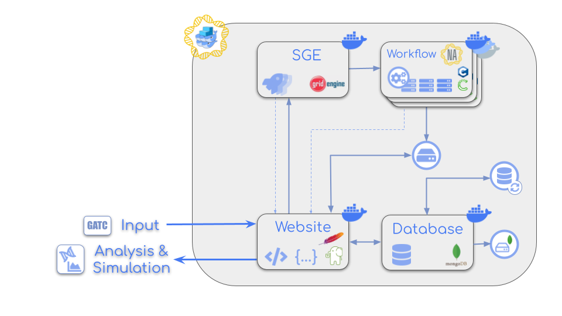

# CGeNArate docker web services

<div align="center"><a href="https://mmb.irbbarcelona.org/CGNAW/"></a></div>

In this repository there are all the files needed for executing the different **CGeNArate** services: **website, workflow and SGE**. All these services have been integrated into **containers** and connected between them via docker **network**.

Schema of **CGeNArate container** web services. Each box in the schema is a service encapsulated into a **docker container**. The services cover the entire process from the **raw data** to the **website** analyses. See the following figure:

<div align="center"></div>

This bunch of **services** aim to show in an intuitive environment the simulation of both **unconstrained** and **constrained** DNA, such as **circular DNA** and **protein-DNA** simulations. The simulations are obtained using [**CGeNArate**](https://academic.oup.com/nar/article/52/12/6791/7685160), a new model for molecular dynamics simulations for **B-DNA** in the context of biotechnological or **chromatin** studies.

## Services description

### Apache / Website

The Apache HTTP Server, colloquially called Apache, is a **Web server** application notable for playing a key role in the initial growth of the World Wide Web:

https://hub.docker.com/_/httpd

In the same container it has been deployed the **GeNArateWeb** website: 

https://github.com/mmb-irb/CGeNArateWeb

This repository **must be cloned** in the same VM where this docker swarm is deployed and pass the absolute path to the **WEBSITE_VOLUME_PATH** variable in the [`.env`](#env-file) file.

### Workflow

The docker workflow runs **CGeNArate**, a new model for **molecular dynamics** simulations for B-DNA in the context of biotechnological or chromatin studies. The developed method uses a **coarse-grained** Hamiltonian with trajectories that are back-mapped to the **atomistic** resolution. The method is sequence-dependent and reproduces very well not only local, but also **global** physical properties of DNA, while its performance exceeds common molecular dynamics simulations by **several orders** of magnitude.

https://github.com/mmb-irb/CGeNArate

### SGE 

**Sun Grid Engine (SGE)** is a grid computing computer cluster software system (otherwise known as a batch-queuing system). It's typically used on a computer farm or **high-performance computing (HPC)** cluster and is responsible for **accepting**, **scheduling**, **dispatching**, and **managing** the remote and distributed **execution** of large numbers of **standalone**, **parallel** or **interactive user jobs**.

http://star.mit.edu/cluster/docs/0.93.3/guides/sge.html

### Database

The database used is **mongodb** inside a docker container:

https://github.com/docker-library/mongo

For this project, the choosen version of mongo is 6. 

Take into account that, in order to **preload databases** at the moment of deploying, a **second mongo container** named **mongo-seed**, is launched and then exited.

### Database backup

There is an specific service that performs a complete database backup every so often depending on a variable defined by the user. To disable this service, define **DB_BACKUP_REPLICAS** to 0.

## Prepare configuration files

### docker-compose.yml

The [**docker-compose.yml**](./docker-compose.yml) is the file that specifies what **images** are required, what **ports** they need to expose, whether they have access to the host **filesystem**, what **commands** should be run when they start up, and so on.

```yaml
services:
  website:
    image: website_image   # name of website image
    hostname: my_stack_website
    build:
      context: ./website  # folder to search Dockerfile for this image
      args:
        WEBSITE_INNER_PORT: ${WEBSITE_INNER_PORT}
    depends_on:
      - mongo-seed
    ports:
      - "${WEBSITE_PORT}:${WEBSITE_INNER_PORT}"   # port mapping, be aware that the second port is the same exposed in the website/Dockerfile
    volumes:
      - ${WEBSITE_DATA_VOLUME_PATH}:/data   # path where the data generated by the website will be stored
      - ${WEBSITE_VOLUME_PATH}:/var/www/html   # path for the website code
      - "${SCRIPTS_VOLUME_PATH}/MCDNA:/scripts/MCDNA"  # path where the scripts used by the website will be stored
      - ${LOGS_VOLUME_PATH}:/logs   # path where the logs will be stored
      - ./website/act_qmaster:/var/lib/gridengine/default/common/act_qmaster
      - ${SSH_KEYS_VOLUME_PATH}:/keys
    networks:
      - sgenet
      - dbnet
    deploy:
      replicas: ${WEBSITE_REPLICAS}   # Specify the number of replicas for Docker Swarm
      resources:
        limits:
          cpus: ${WEBSITE_CPU_LIMIT}   # Specify the limit number of CPUs
          memory: ${WEBSITE_MEMORY_LIMIT}   # Specify the limit memory
        reservations:
          cpus: ${WEBSITE_CPU_RESERVATION}   # Specify the reserved number of CPUs
          memory: ${WEBSITE_MEMORY_RESERVATION}   # Specify the reserved memory
      restart_policy:
        condition: any   # Restart always
      update_config:
        order: start-first  # Priority over other services

  workflow:
    image: workflow_image   # name of workflow image
    # platform: linux/amd64
    build:
      context: ./workflow  # folder to search Dockerfile for this image
    volumes:
      - workflow_data:/mnt
      - workflow_scripts:/app/Scripts
    deploy:
      replicas: ${WORKFLOW_REPLICAS}  # Ensure this service is not deployed by default as it is a one-time task
      resources:
        limits:
          cpus: ${WORKFLOW_CPU_LIMIT}   # Specify the limit number of CPUs
          memory: ${WORKFLOW_MEMORY_LIMIT}   # Specify the limit memory
        reservations:
          cpus: ${WORKFLOW_CPU_RESERVATION}   # Specify the reserved number of CPUs
          memory: ${WORKFLOW_MEMORY_RESERVATION}   # Specify the reserved memory

  sge:
    image: sge_image   # name of SGE image
    hostname: my_stack_sge
    build:
      context: ./sge  # folder to search Dockerfile for this image
      args:
        DOCKER_GROUP_ID: ${DOCKER_GROUP_ID}
        SUBMITTER_HOSTNAME: ${SUBMITTER_HOSTNAME}
        SGE_SSH_PORT: ${SGE_SSH_PORT}
        SGE_PORT: ${SGE_PORT}
        SGE_MAX_JOBS: ${SGE_MAX_JOBS}
    networks:
      - sgenet
    depends_on:
      - mongo-seed
    ports:
      - "${SGE_SSH_PORT}:${SGE_SSH_PORT}"
      - "${SGE_PORT}:${SGE_PORT}"
    volumes:
      - workflow_data:/data
      - workflow_scripts:/scripts
      - /var/run/docker.sock:/var/run/docker.sock
      - ${SSH_KEYS_VOLUME_PATH}:/keys
      - ${LOGS_VOLUME_PATH}:/logs
    devices:
      - '/dev/fuse:/dev/fuse'
    cap_add:
        - SYS_ADMIN
    security_opt:
        - apparmor:unconfined
    stdin_open: true
    restart: always
    deploy:
      replicas: ${SGE_REPLICAS}  # Ensure this service is not deployed by default as it is a one-time task
      placement:
        constraints:
          - node.role == manager
      resources:
        limits:
          cpus: ${SGE_CPU_LIMIT}   # Specify the limit number of CPUs
          memory: ${SGE_MEMORY_LIMIT}   # Specify the limit memory
        reservations:
          cpus: ${SGE_CPU_RESERVATION}   # Specify the reserved number of CPUs
          memory: ${SGE_MEMORY_RESERVATION}   # Specify the reserved memory

  mongodb:
    image: mongo:6
    environment:
      MONGO_INITDB_ROOT_USERNAME: ${MONGO_INITDB_ROOT_USERNAME}
      MONGO_INITDB_ROOT_PASSWORD: ${MONGO_INITDB_ROOT_PASSWORD}
      MONGO_PORT: ${DB_OUTER_PORT}
      MONGO_INITDB_DATABASE: ${DB_DATABASE}
      WEBSITE_SERVER_DB_LOGIN: ${WEBSITE_DB_LOGIN}
      WEBSITE_SERVER_DB_PASSWORD: ${WEBSITE_DB_PASSWORD}
      DB_COLLECTION_WFS: ${DB_COLLECTION_WFS}
      DB_COLLECTION_PRJ: ${DB_COLLECTION_PRJ}
    ports:
      - "${DB_OUTER_PORT}:${DB_INNER_PORT}"
    volumes:
      - ${DB_VOLUME_PATH}:/data/db   # path where the database will be stored (outside the container, in the host machine)
      - ./mongodb/mongo-init.js:/docker-entrypoint-initdb.d/mongo-init.js:ro   # path to the initialization script
    networks:
      - dbnet
    deploy:
      replicas: ${DB_REPLICAS}   # Specify the number of replicas for Docker Swarm
      resources:
        limits:
          cpus: ${DB_CPU_LIMIT}    # Specify the limit number of CPUs
          memory: ${DB_MEMORY_LIMIT}   # Specify the limit memory
        reservations:
          cpus: ${DB_CPU_RESERVATION}   # Specify the reserved number of CPUs
          memory: ${DB_MEMORY_RESERVATION}   # Specify the reserved memory
      restart_policy:
        condition: on-failure   # Restart only on failure

  mongo-seed:
    image: mongo:6
    environment:
      MONGO_INITDB_ROOT_USERNAME: ${MONGO_INITDB_ROOT_USERNAME}
      MONGO_INITDB_ROOT_PASSWORD: ${MONGO_INITDB_ROOT_PASSWORD}
      MONGO_PORT: ${DB_OUTER_PORT}
      MONGO_INITDB_DATABASE: ${DB_DATABASE}
      DB_HOST: ${DB_HOST}
      DB_COLLECTION_WFS: ${DB_COLLECTION_WFS}
      DB_COLLECTION_PRJ: ${DB_COLLECTION_PRJ}
    depends_on:
      - mongodb
    networks:
      - dbnet
    volumes:
      - "./mongodb/${DB_COLLECTION_WFS}.json:/${DB_COLLECTION_WFS}.json:ro"
      - "./mongodb/${DB_COLLECTION_PRJ}.json:/${DB_COLLECTION_PRJ}.json:ro"
      - ./mongodb/import.sh:/import.sh:ro
      - ${SSH_KEYS_VOLUME_PATH}:/keys
      - ${LOGS_VOLUME_PATH}:/logs
    entrypoint: ["bash", "/import.sh"]
    deploy:
      replicas: 1  # Ensures it runs only once
      restart_policy:
        condition: none  # Prevents auto-restart after completion

  mongo-backup:
    image: mongo
    command: >
      bash -c "sh /backup_script.sh"
    volumes:
      - ${DB_BACKUP_VOLUME_PATH}:/backup
      - ./mongodb/backup_script.sh:/backup_script.sh:ro
    environment:
      MONGO_INITDB_ROOT_USERNAME: ${MONGO_INITDB_ROOT_USERNAME}
      MONGO_INITDB_ROOT_PASSWORD: ${MONGO_INITDB_ROOT_PASSWORD}
      MONGO_PORT: ${DB_OUTER_PORT}
      MONGO_INITDB_DATABASE: ${DB_DATABASE}
      DB_HOST: ${DB_HOST}
      BACKUP_DIR: /backup
      RETENTION_COUNT: ${DB_BACKUP_RETENTION_COUNT}
      BACKUP_INTERVAL: ${DB_BACKUP_INTERVAL}
    networks:
      - dbnet
    depends_on:
      - mongodb
    deploy:
      replicas: ${DB_BACKUP_REPLICAS}
      resources:
        limits:
          cpus: ${DB_BACKUP_CPU_LIMIT}    # Specify the limit number of CPUs
          memory: ${DB_BACKUP_MEMORY_LIMIT}   # Specify the limit memory
        reservations:
          cpus: ${DB_BACKUP_CPU_RESERVATION}   # Specify the reserved number of CPUs
          memory: ${DB_BACKUP_MEMORY_RESERVATION}   # Specify the reserved memory
      restart_policy:
        condition: on-failure   # Restart only on failure

volumes:
  workflow_data:
    external: true
  workflow_scripts:
    external: true

networks:
  dbnet: 
    external: true   # Use an external network
  sgenet:
    external: true   # Use an external network
```

All the variables are defined in a `.env` file. See following section.

### .env file

⚠️ No sensible default value is provided for any of these fields, they **need to be defined** ⚠️

An `.env` file must be created in the root folder. The file [`.env.git`](./.env.git) can be taken as an example. The file must contain the following environment variables:

| key              | value   | description                                     |
| ---------------- | ------- | ----------------------------------------------- |
| DOCKER_DEFAULT_PLATFORM         | string  | default platform (architecture and operating system), ie linux/amd64                               |
| &nbsp;
|WEBSITE_DATA_VOLUME_PATH         | string  | path where the website will retrieve the data generated by the workflow                             |
|WEBSITE_VOLUME_PATH         | string  | path where the website code is stored                               |
|SCRIPTS_VOLUME_PATH         | string  | path where the scripts are stored                               |
|LOGS_VOLUME_PATH        | string  | path where the logs are stored                               |
|WEBSITE_PORT         | number  | website outer port    stored                                |
|WEBSITE_INNER_PORT         | number  | website inner port                                   |
|WEBSITE_REPLICAS         | number  | website number of replicas to deploy                               |
|WEBSITE_CPU_LIMIT         | string  | website limit number of CPUs                                |
|WEBSITE_MEMORY_LIMIT         | string  | website limit memory                                 |
|WEBSITE_CPU_RESERVATION         | string  | website reserved number of CPUs                               |
|WEBSITE_MEMORY_RESERVATION         | string  | website reserved memory                                  |
|WEBSITE_DB_LOGIN         | string  | db user for website REST API                               |
|WEBSITE_DB_PASSWORD         | string  | db password for website REST API                               |
| &nbsp;
|WORKFLOW_REPLICAS         | number  | workflow number of replicas to deploy                               |
|WORKFLOW_CPU_LIMIT         | string  | workflow limit number of CPUs                                |
|WORKFLOW_MEMORY_LIMIT         | string  | workflow limit memory                                 |
|WORKFLOW_CPU_RESERVATION         | string  | workflow reserved number of CPUs                               |
|WORKFLOW_MEMORY_RESERVATION         | string  | workflow reserved memory            
| &nbsp;
|SGE_REPLICAS         | number  | SGE number of replicas to deploy                               |
|SGE_CPU_LIMIT         | string  | SGE limit number of CPUs                                |
|SGE_MEMORY_LIMIT         | string  | SGE limit memory                                 |
|SGE_CPU_RESERVATION         | string  | SGE reserved number of CPUs                               |
|SGE_MEMORY_RESERVATION         | string  | SGE reserved memory            |
|SGE_MAX_JOBS        | number  | Maximum number of concurrent jobs            |
|DOCKER_GROUP_ID         | number  | GID for group 'docker'                               |
|SUBMITTER_HOSTNAME         | string  | hostname of the submitter (my_stack_website)                      |
|SGE_PORT         | number  | SGE port                               |
|SGE_SSH_PORT         | number  | SSH port                               |
|SSH_KEYS_VOLUME_PATH         | string  | path where the SSH keys will be stored                               |
| &nbsp;
|DB_VOLUME_PATH         | string  | path where the DB will look for files                               |
|DB_OUTER_PORT         | number  | DB outer port                                  |
|DB_INNER_PORT         | number  | DB inner port                                |
|DB_REPLICAS         | number  | DB number of replicas to deploy                               |
|DB_CPU_LIMIT         | string  | DB limit number of CPUs                               |
|DB_MEMORY_LIMIT         | string  | DB limit memory                               |
|DB_CPU_RESERVATION         | string  | DB reserved number of CPUs                               |
|DB_MEMORY_RESERVATION         | string  | DB reserved memory                               |
|DB_HOST         | `<url>`  | url of the db server                               |
|DB_DATABASE         | string  | name of the  DB collection                               |
|DB_AUTHSOURCE         | string  | the DB collection the user will attempt to authenticate                               |
|DB_COLLECTION_WFS         | string  | collection for workflow steps (static)                               |
|DB_COLLECTION_PRJ         | string  | collection where all the projects data will be stored                               |
| &nbsp;
|DB_BACKUP_VOLUME_PATH         | string  | path where the DB backups will be stored                               |
|DB_BACKUP_RETENTION_COUNT         | number  | maximum number of DB backup copies to preserve                               |
|DB_BACKUP_INTERVAL         | number  | interval in seconds between DB backups                               |
|DB_BACKUP_REPLICAS         | number  | DB backup number of replicas to deploy                               |
|DB_BACKUP_CPU_LIMIT         | string  | DB backup limit number of CPUs                                 |
|DB_BACKUP_MEMORY_LIMIT         | string  | DB backup limit memory                                |
|DB_BACKUP_CPU_RESERVATION         | string  | DB backup reserved number of CPUs                               |
|DB_BACKUP_MEMORY_RESERVATION         | string  | DB backup reserved memory                               |
| &nbsp;
|MONGO_INITDB_ROOT_USERNAME         | string  | root user for the DB                               |
|MONGO_INITDB_ROOT_PASSWORD         | string  | root password for the DB                               |

**Important:** the formats of **cpus** and **memory** must be in string format between single quotes. Example:

```
WEBSITE_VOLUME_PATH=/path/to/webcode  # path to web code
WEBSITE_CPU_LIMIT='2.00'  # cpus in float format
WEBSITE_MEMORY_LIMIT='2G'  # memory indicating unit (G, M)
```

The **DB_HOST** must be the name of the **stack service** followed by **underscore** and the **name of the service** as defined in the [**docker-compose.yml**](./docker-compose.yml) file (ie _my_stack_mongodb_).

The **DB_DATABASE** and **DB_AUTHSOURCE** must be the same used in the **mongo-init.js** file.

The credentials **WEBSITE_DB_LOGIN** and **WEBSITE_DB_PASSWORD** must be the same defined in the **mongo-init.js** file with the **readWrite** role.

## Prepare storage

Some volumes and folders are needed before building and deploying the docker containers.

### Data

The **path** assigned to the **WEBSITE_DATA_VOLUME_PATH** variable in the [`.env`](#env-file) file.

In the **volume** where the data is stored, create the following **/data folder**:

    /path/to/volume/data

All the **data generated by the workflow** will be stored inside this volume.

Inside this path, create a **/Web** folder with permissions for user **www-data:www-data**.

### Website code

The **path** assigned to the **WEBSITE_VOLUME_PATH** variable in the [`.env`](#env-file) file.

Go to somewhere in the **VM** where all the **swarm** will be deployed or in the **volume** where the data is stored, and clone the **website code**:

https://github.com/mmb-irb/CGeNArateWeb

### Scripts

The **path** assigned to the **SCRIPTS_VOLUME_PATH** variable in the [`.env`](#env-file) file.

This folder is in this same repository, in the [**/scripts**](./scripts/) folder

### SSH Keys

The **path** assigned to the **SSH_KEYS_VOLUME_PATH** variable in the [`.env`](#env-file) file.

Go to somewhere in the **VM** where all the **swarm** will be deployed or in the **volume** where the data is stored and create a **/ssh_keys folder**.

### Logs

The **path** assigned to the **LOGS_VOLUME_PATH** variable in the [`.env`](#env-file) file.

Go to somewhere in the **VM** where all the **swarm** will be deployed or in the **volume** where the data is stored and create a **/logs folder**.

### MongoDB

The **path** assigned to the **DB_VOLUME_PATH** variable in the [`.env`](#env-file) file.

In the **volume** where the data is stored, create the following **/db folder**:

    /path/to/volume/db

All the **MongoDB** data will be stored inside this volume.

### MongoDB Backup

The **path** assigned to the **DB_BACKUP_VOLUME_PATH** variable in the [`.env`](#env-file) file.

In the **volume** where the data is stored, create the following **/db_backup folder**:

    /path/to/volume/db_backup

**Note: it's highly recommended to store the backups in a different volume where the MongoDB data is stored, so in case the main volume fails, the backups are safe in another one.** 

All the **MongoDB** data backups will be stored inside this volume.

## Setup website code

The website code is in a repository apart:

https://github.com/mmb-irb/CGeNArateWeb

Please **clone it** somewhere in the VM where the stack will be deployed:

    git clone https://github.com/mmb-irb/CGeNArateWeb.git

The path for this code must be assigned to the **WEBSITE_VOLUME_PATH** variable in the [`.env`](#env-file) file.

Once cloned, go to the /app folder in the website structure and **create a new config.php file** taking [**config.git.php**](https://github.com/mmb-irb/CGeNArateWeb/blob/main/app/config.git.php) as a reference. In this file, some **paths** and **credentials** must be added. 

> **IMPORTANT:** The paths must be referred to the **docker container** where the website is executed. So, for example, the path for **diskPath** should be **/data/Web/** : `'diskPath' => '/data/Web/'`

## Build services

Check that mongodb/import.sh has exec permissions, if not:

    chmod +x mongodb/import.sh

Go to the root of the project. Then, init **Docker Swarm**:

```sh
docker swarm init
```

**Note:** when a system has **multiple network** interfaces with **different IP** addresses, Docker Swarm requires you to explicitly **specify which IP** address it should use for advertising:

```sh
docker swarm init --advertise-addr <IP_ADDRESS>
```

In order to **share volumes** between the different **services** they must be created beforehand. They must be created before the `docker-compose build` and the `docker stack deploy`:

```sh
docker volume create --driver local --opt type=none --opt device=/path/to/data --opt o=bind workflow_data
docker volume create --driver local --opt type=none --opt device=/path/to/scripts --opt o=bind workflow_scripts
```

Where /path/to/data is the path where **the workflow will store its outputs** and the **website will seek for the data**. Defined in [`.env`](#env-file) as **WEBSITE_DATA_VOLUME_PATH**. And /path/to/scripts is the path where **the workflow will look for scripts**. Defined in [`.env`](#env-file) as **SCRIPTS_VOLUME_PATH**.

In order to execute the **long-term** tasks in **Docker Swarm** and the **one-off tasks**, such as the **workflow** in this prject, the **networks** are declared as **external** in the **docker-compose.yml** file, so they must be created before the `docker-compose build` and the `docker stack deploy`:

```sh
docker network create --driver overlay --attachable dbnet
docker network create --driver overlay --attachable sgenet
```

***

Workaround for **deploying in macOS**:

**Uncomment** in the [**docker-compose.yml**](./docker-compose.yml#L39) file the line:

```yaml
platform: linux/amd64
```

Run `docker compose build` and comment the line again before executing `docker stack deploy`.

***

> NOTE: **From July 2024 onwards**, the instruction for Docker Compose in **mac** is without hyphen, so from now on, `docker-compose build` is `docker compose build` when executing in **macOS**.

For building the services via **Docker Compose**, please execute the following instruction:

```sh
docker-compose build
```

Export environment variables defined in [**root .env file**](#env-file) and deploy docker stack:

```sh
export $(grep -v '^#' .env | xargs)
docker stack deploy -c docker-compose.yml my_stack
```

Check services:

```sh
$ docker stack services my_stack
ID             NAME                  MODE         REPLICAS   IMAGE                  PORTS   
<ID>           my_stack_mongo-seed   replicated   0/1        mongo:6                
<ID>           my_stack_mongodb      replicated   1/1        mongo:6                *:27017->27017/tcp
<ID>           my_stack_sge          replicated   1/1        sge_image:latest       *:222->222/tcp, *:6444->6444/tcp
<ID>           my_stack_website      replicated   1/1        website_image:latest   *:80->3001/tcp
<ID>           my_stack_workflow     replicated   0/0        workflow_image:latest
```

Check nodes:

```sh
docker node ls
```

## Execute services

### Use workflow

While the **mongodb**, **client** and **rest** containers will remain up, the **workflow** must be called every time is needed. As it is a **one-off task**, **Docker Compose** is used for running it.

#### Check workflow

```sh
docker compose run --rm workflow ls -la /mnt
```

Or, if the above doesn't work:

```sh
docker run --rm -v workflow_data:/mnt workflow_image ls -la /mnt
```

#### Execute workflow

Take into account that, for running properly the workflow, a **launch.sh file** with the **correct format** must be created beforehand in the folder defined in 
**WEBSITE_DATA_VOLUME_PATH** in the [`.env`](#env-file) file. This template can be taken as an example for creating this **launch.sh file**:

```sh
#!/bin/csh

cd /mnt/folder

hostname > hostname.out

echo "## CGeNArate ##"
perl /app/Scripts/MCDNA/runMCDNA_all_new.pl /mnt/folder/inputSequence.txt 1 0 0

echo "## Analysis ##"
perl /app/Scripts/Analysis/runMCDNA_Analysis.pl 1 0 0
```

And **inputSequence.txt** is the **input sequence** in text format and it must be as well in the **same folder** as the **.sh file**. For example:

```sh
GATTACATACATACAGATTACATACATACAGATTACATACATACAGATTACATACATACAGATTACATACATACAGATTACATACATACA
```

Then, once both files **launch.sh** and **inputSequence.txt** are in the same folder inside **WEBSITE_DATA_VOLUME_PATH**, the workflow can be launched:

```sh
docker compose run --rm workflow sh /mnt/folder/launch.sh
```
Or, if the above doesn't work:

```sh
docker run --rm -v workflow_data:/mnt -v workflow_scripts:/app/Scripts workflow_image sh /mnt/folder/launch.sh
```

### Check website

Open a browser and type:

```
http://localhost/public/
```

## Stop services

Remove stack:

```sh
docker stack rm my_stack
```

Leave swarm:

```sh
docker swarm leave --force
```

## Tips

### Rebuild service(s)

A **rebuild script** is provided for rebuilding **one or more services** in an **automatic** way. Please execute the script, located in [**scripts/helper/rebuild.py**](./scripts/helper/rebuild.py). 

How to execute the help script from the root of this repository:

```sh
python3 scripts/helpers/rebuild.py -h
```

Example for rebuilding the **website** and **sge** services from the **my_stack** stack: 

```sh
python3 scripts/helpers/rebuild.py -s website sge -t my_stack
```

For performing the same process step by step:

1. **Rebuild the Service Image Without Cache:** Use docker-compose to rebuild the image locally, targeting only the service you want to update:

    ```sh
    docker-compose build --no-cache <service_name>
    ```

2. **Update the Service in the Swarm:** In Docker Swarm, you can force the service to use the updated image by running:

    ```sh
    docker service update --force <stack_name>_<service_name>
    ```

3. **Remove Stopped Container(s):** After updating the service, the old container remains stopped, execute the following instruction for removing it:

    ```sh
    docker container prune -f
    ````

4. **Remove Unused Image(s):** After rebuilding the image, the old image remains unused, execute the following instruction for removing it:

    ```sh
    docker image prune -f
    ```

### Clean docker

When working with Docker, **even after removing images and containers**, Docker can leave behind various unused resources that take up **disk space**. To clean up your system effectively, you can use the following commands:

1. **Remove** unused containers, images and networks:

    Docker has a built-in command to clean up resources that are not in use:

        docker system prune

    This command will prompt you to confirm that you want to remove all unused data. If you want to avoid the prompt, you can add the -f (force) flag:

        docker system prune -f

2. **Cleaning up** the Docker builder **cache**:

    Docker build cache can also take up significant space. You can remove unused build cache:

        docker builder prune

    If you want to remove all build cache, including the cache used by the active build process:

        docker builder prune -a -f

3. Remove unused **volumes**:

    By default, docker system prune does not remove unused volumes. If you want to remove them as well, you can use:

        docker system prune --volumes

    If you want to avoid the prompt, you can add the -f (force) flag:

        docker system prune --volumes -f

    To ensure, list volumes:

        docker volume ls

    For removing all volumes (beware):

        docker volume rm $(docker volume ls -q)

4. Remove unused **networks**:

    Usually, the steps above remove the networks related to the project, but this instruction removes the unused networks:

        docker network prune -f

    To ensure, list networks:

        docker network ls

5. **Check disk usage** by Docker objects

        docker system df


### Execute mongo docker in terminal mode

```sh
docker exec -it <mongo_container_ID> bash
```

And then: 

```sh
mongosh 
```

For entering the database in **terminal mode**. Take into account that, for **checking** your database and its **collections**, you must use the **authentication credentials** defined in the [**mongo-init.js**](./mongodb/mongo-init.js) file. For example, for checking the **collections** of the CGeNArate **database**, please follow the next steps:

Switch to **CGeNArate** database (or the name defined in the [**mongo-init.js**](./mongodb/mongo-init.js) file):

    use CGeNArate

**Authenticate** with one of the **users** defined in the [**mongo-init.js**](./mongodb/mongo-init.js) file:

    db.auth('user_rw','pwd_rw');

Execute some mongo shell instruction:

    show collections

Additionally, users are able to access the database as a **root/admin** user, as defined in the [**docker-compose.yml**](./docker-compose.yml) file:

    mongosh --username <ROOT_USER> --password <ROOT_PASSWORD>

Take into account that acessing mongoDB as **root/admin** user is **not recommended** as with this user there are **no restrictions** once inside the database. We strongly recommend to use the **users** defined in the [**mongo-init.js**](./mongodb/mongo-init.js) file for accessing the database.

### Apache logs

    docker logs <website_container_ID>

### Check containers

Check that the **mongo** and the replicas of **web containers** are up & running:

```sh
$ docker ps -a
CONTAINER ID   IMAGE                  COMMAND                  CREATED         STATUS                 PORTS             NAMES
<ID>           mongo:6                "docker-entrypoint.s…"   2 days ago      Up 2 days              27017/tcp         my_stack_mongodb.1.<ID>
<ID>           website_image:latest   "/app/entrypoint.sh …"   2 days ago      Up 2 days              80/tcp, 3001/tcp  my_stack_website.1.<ID>
<ID>           sge_image:latest       "bash -c 'service ss…"   2 days ago      Up 2 days              22/tcp, 6444/tcp  my_stack_sge.1.<ID>
<ID>           mongo:6                "bash /import.sh"        2 days ago      Exited (0) 2 days ago                    my_stack_mongo-seed.1.<ID>
```

Note that, as the mongo-seed container only is used in the moment of deploying, it can be removed.

### Inspect docker network 

```sh
docker network inspect dbnet
```

should show something like:

```json
[
    {
        "Name": "dbnet",
        "Id": "<ID>",
        "Created": "<DATE>",
        "Scope": "swarm",
        "Driver": "overlay",
        "EnableIPv6": false,
        "IPAM": {
            "Driver": "default",
            "Options": null,
            "Config": [
                {
                    "Subnet": "<IP>",
                    "Gateway": "<IP>"
                }
            ]
        },
        "Internal": false,
        "Attachable": true,
        "Ingress": false,
        "ConfigFrom": {
            "Network": ""
        },
        "ConfigOnly": false,
        "Containers": {
            "<ID>": {
                "Name": "my_stack_website.1.<ID>",
                "EndpointID": "<ID>",
                "MacAddress": "<MAC>",
                "IPv4Address": "<IP>",
                "IPv6Address": ""
            },
            "<ID>": {
                "Name": "my_stack_mongodb.1.<ID>",
                "EndpointID": "<ID>",
                "MacAddress": "<MAC>",
                "IPv4Address": "<IP>",
                "IPv6Address": ""
            },
            "lb-dbnet": {
                "Name": "dbnet-endpoint",
                "EndpointID": "<ID>",
                "MacAddress": "<MAC>",
                "IPv4Address": "<IP>",
                "IPv6Address": ""
            }
        },
        "Options": {
            "com.docker.network.driver.overlay.vxlanid_list": "<ID>"
        },
        "Labels": {},
        "Peers": [
            {
                "Name": "<ID>",
                "IP": "<IP>"
            }
        ]
    }
]
```

### Scale a service:

Add one more replica to my_stack_website:

```sh
docker service scale my_stack_website=2
```

## Stop a service:

Stop my_stack_mongo-backup service:

```sh
docker service rm my_stack_mongo-backup
```

### Check service tasks

```sh
docker service ps my_stack_mongodb
```

### Docker stats

Check resources consumption for all running containers:

```sh
$ docker stats
CONTAINER ID   NAME                       CPU %     MEM USAGE / LIMIT   MEM %     NET I/O           BLOCK I/O         PIDS
<ID>           my_stack_mongodb.1.<ID>    0.44%     105.2MiB / 2GiB     1.28%     43.1MB / 247MB    0B / 499MB        50
<ID>           my_stack_sge.1.<ID>        0.27%     129.1MiB / 1GiB     12.61%    746B / 0B         0B / 23.1MB       23
<ID>           my_stack_website.1.<ID>    0.26%     73.03MiB / 2GiB     0.71%     59.3MB / 29.9MB   0B / 24.6kB       22
```

### Docker logs

Show logs for a service:

```sh
docker service logs my_stack_mongodb
```

## Credits

David Farré-Gil, Genís Bayarri, Adam Hospital.

## Copyright & licensing

This website has been developed by the [MMB group](https://mmb.irbbarcelona.org) at the [IRB Barcelona](https://irbbarcelona.org).

© 2025 **Institute for Research in Biomedicine**

Licensed under the [**Apache License 2.0**](LICENSE).